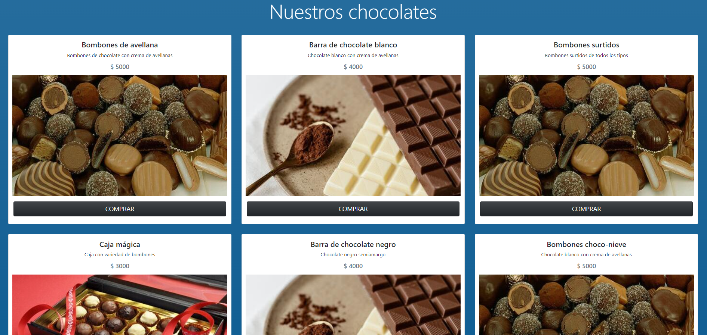
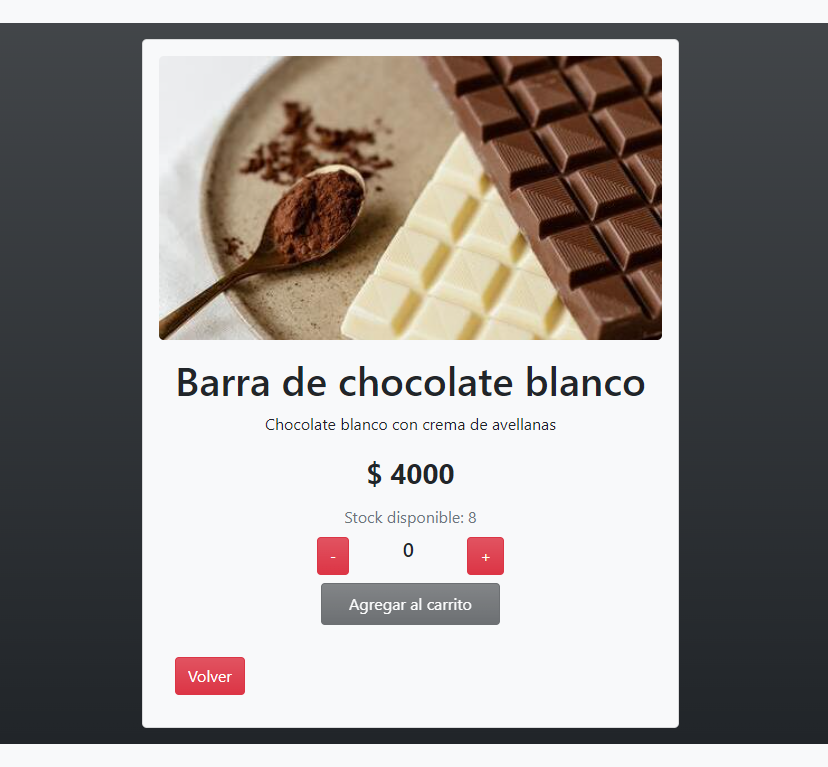
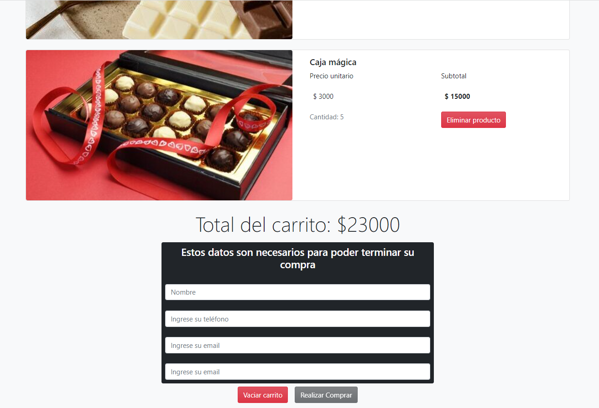
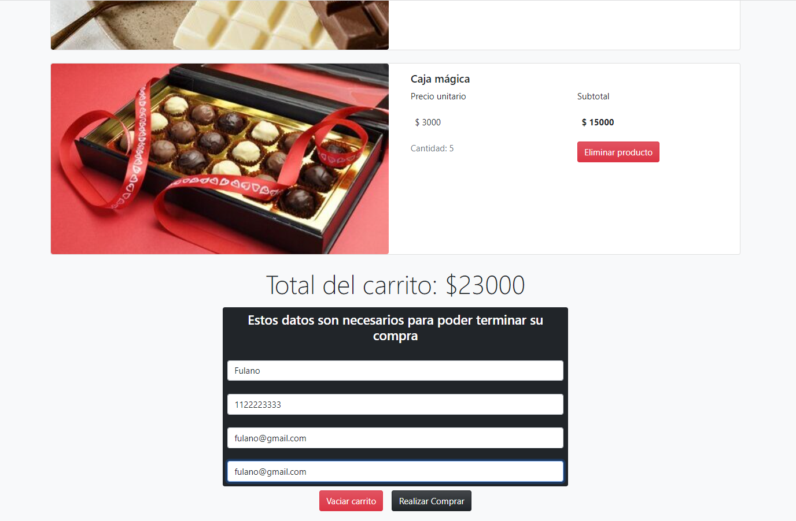
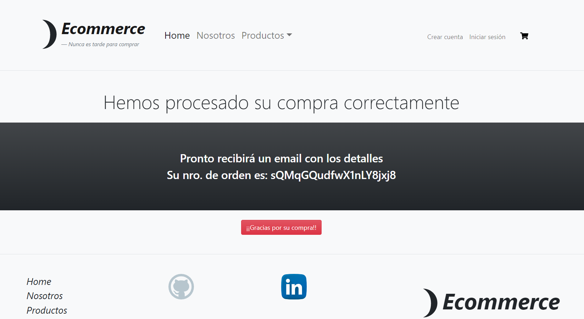
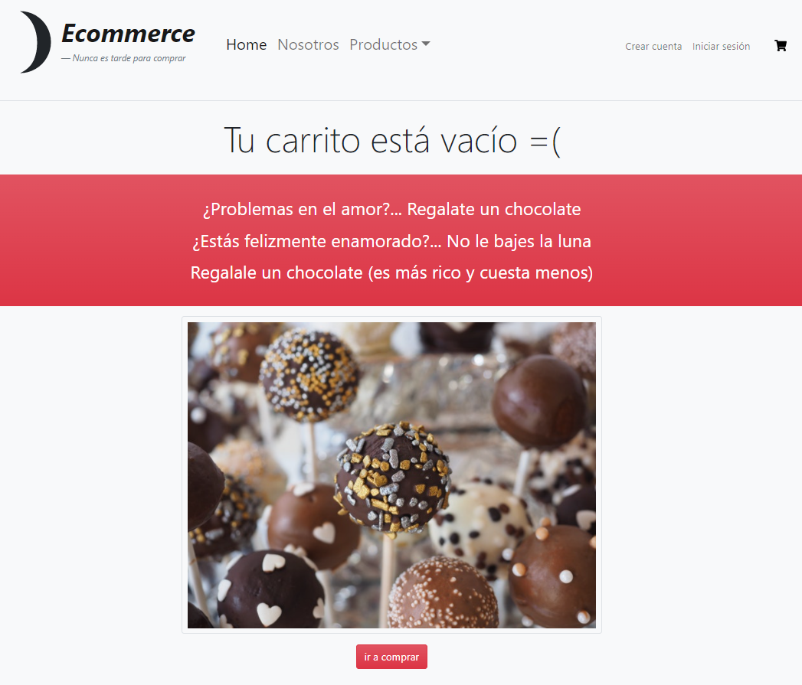

# **Ecommerce - React.js** 
# *Curso de React de Coderhouse*
### **Nahuel-DevOne**

# *Información del proyecto:*

Este es mi proyecto final, para el curso de React.js en [CoderHouse](https://www.coderhouse.com), que forma parte de la carrera de desarrollador web full stack.  
Consiste en un ecommerce implementado con React.js junto React Router, React Hooks, Librería de Bootstrap y Firebase.

## *Version 1.0.0:*

- 

- Se usa como base de datos Firestore
## *Desarrollado con:*

- [Visual Studio Code](https://code.visualstudio.com/)
- [React](https://reactjs.org/)
- [Create react app](https://create-react-app.dev/)
- [Babel](https://babeljs.io/)
- [Webpack](https://webpack.js.org/)
- [SCSS](http://sass-lang.com/)
- [Bootstrap](https://getbootstrap.com/)
- [react-icons](https://react-icons.github.io/react-icons)

# *Screenshots:*

**Sobre el flujo de compra:**

### 1. Home:
## 

### 2. Detalle del producto seleccionado:

## 

### 3. Carrito de compras, con productos seleccionados:

## 

### 4. Carrito de compras, con productos y formulario completo:

## 
### 5. Fin de la compra y mensaje al usuario:

## 

### 6. Si no hay productos en el carrito:

## 
# *Flujo de Compra*
  
Para poder comprar uno o más productos, se debe seleccionar desde el Home, en la galería de productos, "COMPRAR" A partir de ahí, ya en la vista de detalle del producto, se debe seleccionar su cantidad para añadirlo al carrito. Para que se habilite el botón de agregar al carrito, debe haber al menos un producto seleccionado. No se permite restar unidades inferiores a cero ni tampoco superar el stock disponible.
Para agregar más productos al carrito, se puede volver al home para seguir sumando productos, que a la vez, de seleccionar el mismo, no se duplica en el carrito, sino que se agrega a la cantidad anteriormente seleccionada.
Una vez seleccionados los productos a comprar, el botón "Agregar al carrito" lleva al carrito con el o los productos seleccionados. De querer eliminar alguno, cada uno tiene su propio botón de eliminar. De querer eliminarlos todos, se encuentra el botón "Vaciar carrito", dejando el carrito vacío con el mensaje de aviso de que no hay productos en el carrito, y un botón para volver al home. No se permite la compra sin productos seleccionados. 
En el caso de haber agregado productos al carrito, con el fin de terminar la compra, se encuentra el botón de "Realizar compra", que se encuentra deshabilitado por defecto, hasta completar el formulario obligatario, a llenar por el cliente. Dichos datos se guardan en firestore, y una vez realizado este proceso, se vacía el carrito y se le devuelve al usuario un mensaje de agradecimiento, junto con su Id de compra y de que esta se ha realizado correctamente.
# *Componentes:*

## 1. *Main*
## 2. *Header*
## 3. *LogoIcono*
## 4. *Footer*
## 5. *Item*
## 6. *ItemCount* 
## 7. *ItemList* 
## 8. *ItemListContainer*
## 9. *ItemDetail*
## 10. *ItemDetailContainer*
## 11. *Cart*
## 12. *CartItem*
## 13. *CartWidget*
## 14. *CartContext*
## 15. *FormBuyer*
#
# ** Información por defecto, con *`Create React App:`* **

This project was bootstrapped with [Create React App](https://github.com/facebook/create-react-app).

## Available Scripts

In the project directory, you can run:

### `npm start`

Runs the app in the development mode.\
Open [http://localhost:3000](http://localhost:3000) to view it in the browser.

The page will reload if you make edits.\
You will also see any lint errors in the console.

### `npm test`

Launches the test runner in the interactive watch mode.\
See the section about [running tests](https://facebook.github.io/create-react-app/docs/running-tests) for more information.

### `npm run build`

Builds the app for production to the `build` folder.\
It correctly bundles React in production mode and optimizes the build for the best performance.

The build is minified and the filenames include the hashes.\
Your app is ready to be deployed!

See the section about [deployment](https://facebook.github.io/create-react-app/docs/deployment) for more information.

### `npm run eject`

**Note: this is a one-way operation. Once you `eject`, you can’t go back!**

If you aren’t satisfied with the build tool and configuration choices, you can `eject` at any time. This command will remove the single build dependency from your project.

Instead, it will copy all the configuration files and the transitive dependencies (webpack, Babel, ESLint, etc) right into your project so you have full control over them. All of the commands except `eject` will still work, but they will point to the copied scripts so you can tweak them. At this point you’re on your own.

You don’t have to ever use `eject`. The curated feature set is suitable for small and middle deployments, and you shouldn’t feel obligated to use this feature. However we understand that this tool wouldn’t be useful if you couldn’t customize it when you are ready for it.

## Learn More

You can learn more in the [Create React App documentation](https://facebook.github.io/create-react-app/docs/getting-started).

To learn React, check out the [React documentation](https://reactjs.org/).

### Code Splitting

This section has moved here: [https://facebook.github.io/create-react-app/docs/code-splitting](https://facebook.github.io/create-react-app/docs/code-splitting)

### Analyzing the Bundle Size

This section has moved here: [https://facebook.github.io/create-react-app/docs/analyzing-the-bundle-size](https://facebook.github.io/create-react-app/docs/analyzing-the-bundle-size)

### Making a Progressive Web App

This section has moved here: [https://facebook.github.io/create-react-app/docs/making-a-progressive-web-app](https://facebook.github.io/create-react-app/docs/making-a-progressive-web-app)

### Advanced Configuration

This section has moved here: [https://facebook.github.io/create-react-app/docs/advanced-configuration](https://facebook.github.io/create-react-app/docs/advanced-configuration)

### Deployment

This section has moved here: [https://facebook.github.io/create-react-app/docs/deployment](https://facebook.github.io/create-react-app/docs/deployment)

### `npm run build` fails to minify

This section has moved here: [https://facebook.github.io/create-react-app/docs/troubleshooting#npm-run-build-fails-to-minify](https://facebook.github.io/create-react-app/docs/troubleshooting#npm-run-build-fails-to-minify)
